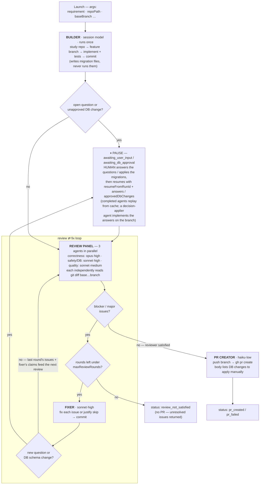
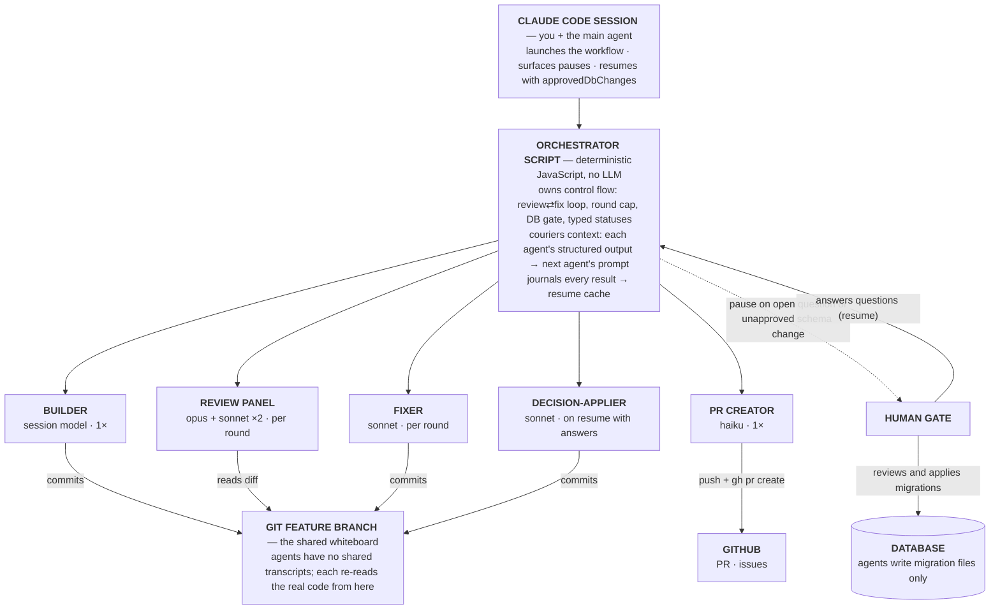

# claude-workflows

Multi-agent workflows for [Claude Code](https://claude.com/claude-code)'s Workflow orchestration tool. Copy a script into `~/.claude/workflows/` and it becomes an invocable command in every session.

## build-review-pr

Implements a requirement end-to-end with a deliberate quality loop:



1. **Builder** studies the repo, implements the requirement on a feature branch, runs tests, commits. It never pushes and never applies database migrations. If it hits a decision only you can make, it finishes everything else, commits, and the run pauses with the question (see "Questions: human in the loop").
2. **Reviewer panel** — three parallel lenses review the diff each round: correctness/requirement-fit, security + DB safety, and code quality. Issues are rated `blocker` / `major` / `minor` / `nit`.
3. **Fixer** addresses every blocking issue (or justifies a skip — the panel judges the justification next round). Like the builder, it can pause the run with questions only a human can answer. The loop repeats until the panel reports **zero blocking issues**, capped by `maxReviewRounds`.
4. **PR creator** pushes the branch and opens the GitHub PR via `gh`, including a "Database schema changes (apply manually)" section when relevant.

### Architecture



Three properties worth noting: all determinism lives in the **script layer** — an LLM never decides whether to loop again; the **agents are stateless workers** whose only outbound channels are their structured output and commits to the branch; and there are exactly **two escape hatches to the outside world** — the human gate (open questions and database changes), and the PR creator in front of GitHub. Everything else is local and reversible.

### Install

```bash
git clone https://github.com/ShyanRoyChoudhury/claude-workflows.git
mkdir -p ~/.claude/workflows
cp claude-workflows/workflows/build-review-pr.js ~/.claude/workflows/
```

Or symlink the directory so `git pull` updates you automatically:

```bash
ln -sfn "$(pwd)/claude-workflows/workflows" ~/.claude/workflows
```

### Usage

In any Claude Code session, type `/build-review-pr` and describe the work, or ask in plain language ("run build-review-pr on ~/code/my-app: add rate limiting to the login endpoint"). Claude launches it as:

```js
Workflow({
  name: 'build-review-pr',
  args: {
    requirement: 'Add rate limiting to the login endpoint (5 attempts/min per IP), with tests',
    repoPath: '/Users/you/code/my-app',
    baseBranch: 'main',
  },
})
```

### Arguments

| arg | required | default | meaning |
|---|---|---|---|
| `requirement` | yes | — | What to build. Precision here directly reduces review rounds. |
| `repoPath` | yes | — | Absolute path to the target git repository. |
| `baseBranch` | no | `main` | Branch to fork from and diff against. |
| `branch` | no | builder picks | Feature branch name. |
| `maxReviewRounds` | no | `5` | Safety cap on review ⇄ fix rounds. |
| `approvedDbChanges` | no | `[]` | Migration file paths a human has approved — used when resuming after a DB pause. |
| `answers` | no | `{}` | Map of question `id` → your answer — used when resuming after an `awaiting_user_input` pause. |
| `skipPr` | no | `false` | Stop after a clean review; don't push or open a PR. |
| `draftPr` | no | `false` | Open the PR as a draft. |

### Return statuses

| status | meaning |
|---|---|
| `pr_created` | Done — `prUrl` points at the PR. |
| `awaiting_db_approval` | Paused: a human must review/apply the listed migrations, then resume (below). |
| `awaiting_user_input` | Paused: the builder or fixer has questions only a human can answer — answer them, then resume (below). |
| `review_not_satisfied` | Hit `maxReviewRounds` with blocking issues still open. No PR was created; the unresolved issues are returned. |
| `reviewed_no_pr` | Clean review, `skipPr` was set. |
| `pr_failed` / `error` | What failed and, for PR auth/remote problems, the exact manual commands to run instead. |

### Database changes: human in the loop

Agents are hard-forbidden from executing schema changes — no DDL against a database, no `prisma migrate` / `alembic upgrade` / `rails db:migrate` / etc. They **write migration files** into the repo and report them. When an unapproved schema change appears (at build time or introduced by a fix), the run returns `awaiting_db_approval` with each migration's description, file path, and SQL.

To resume after applying (or authorizing) the changes yourself, relaunch with the run's ID and the approved paths:

```js
Workflow({
  name: 'build-review-pr',
  resumeFromRunId: 'wf_...',            // from the original run
  args: { ...sameArgsAsBefore, approvedDbChanges: ['migrations/0042_add_index.sql'] },
})
```

Every completed agent replays from cache on resume — you don't pay for the build or earlier review rounds again. This works because no agent prompt embeds `approvedDbChanges` or `answers` (the answers appear only in the decision-applier's prompt, which first runs *after* the pause); keep it that way if you modify the script.

### Questions: human in the loop

The builder and fixer never guess on decisions only you can make — an ambiguous requirement with no conventional default, a product/behavior choice, missing credentials or access. The agent finishes and commits everything *not* blocked by the question, then the run returns `awaiting_user_input` with each question's `id`, `question`, `context`, and `options`. Resume with your answers keyed by question id:

```js
Workflow({
  name: 'build-review-pr',
  resumeFromRunId: 'wf_...',            // from the original run
  args: { ...sameArgsAsBefore, answers: { 'session-timeout-duration': '30 minutes, sliding' } },
})
```

On resume, completed agents replay from cache and a **decision-applier** agent implements your answers on the branch — its commits are re-reviewed by the panel like any other change. Answered decisions are shown to later reviewers and fixers as settled, so they aren't re-litigated. Agents are told to use this channel sparingly: anything a reasonable convention or repo precedent can settle becomes a recorded assumption instead of a question. Reviewers don't ask questions directly — a reviewer concern that needs a human decision surfaces as a blocking issue, and the fixer escalates it to you only if it can't be resolved in code.

One edge: if the fixer raises questions on the *final* allowed round, the run doesn't pause — there would be no round left to review the applied answers — and instead returns `review_not_satisfied` with the questions in `openQuestions`.

### Model tiering

Token cost is dominated by the per-round agents (3 reviewers + fixer), not the one-shot ones. The tiering principle: **spend where mistakes escape the pipeline, economize where the loop catches them.** Every seat also runs under the [`fable-mode` skill](https://gist.github.com/ShyanRoyChoudhury/485fbed056134e824a28c1195c8d1903)'s discipline — inlined directly in the script, so no skill installation is needed — which narrows the behavioral gap for the lower-tier seats. (Installing the gist as a personal skill is still worthwhile if you want `/fable-mode` in interactive sessions.)

| seat | model | why |
|---|---|---|
| builder | inherits session | Open-ended design work; a weaker builder buys you extra review rounds that cost more than it saves. |
| review: correctness | `opus` | The final quality gate — what it misses, ships. Keep this at or above the builder's tier, or it rubber-stamps the builder's blind spots. |
| review: safety/DB | `sonnet` | Mostly mechanical verification. |
| review: quality | `sonnet` (effort `medium`) | Convention/pattern matching. |
| fixer | `sonnet` | Receives precisely-described issues with suggested fixes, and its output is re-reviewed next round. |
| decision-applier | `sonnet` | Runs only on resume, applying precisely-specified human answers; its commits are re-reviewed by the panel. |
| pr-creator | `haiku` | Pure mechanics. |

If you experiment with different assignments, please share results in an issue — round counts and escaped-bug anecdotes are exactly the data this needs.

### Requirements

- Claude Code with the Workflow tool (multi-agent orchestration) available.
- The target is a git repository; `baseBranch` exists.
- `gh` CLI authenticated with push access to the repo's `origin` (only needed for the PR step; on auth failure the workflow returns manual commands instead of improvising).

### Contributing

PRs for improvements, issues for findings — model-tier experiments, prompts that reduced false-positive reviews, repos/frameworks where the DB-change detection missed something. One caution when editing prompts: any change to an `agent()` call's prompt or options invalidates the resume cache for in-flight paused runs, so batch prompt edits rather than trickling them.

## License

[MIT](LICENSE)
